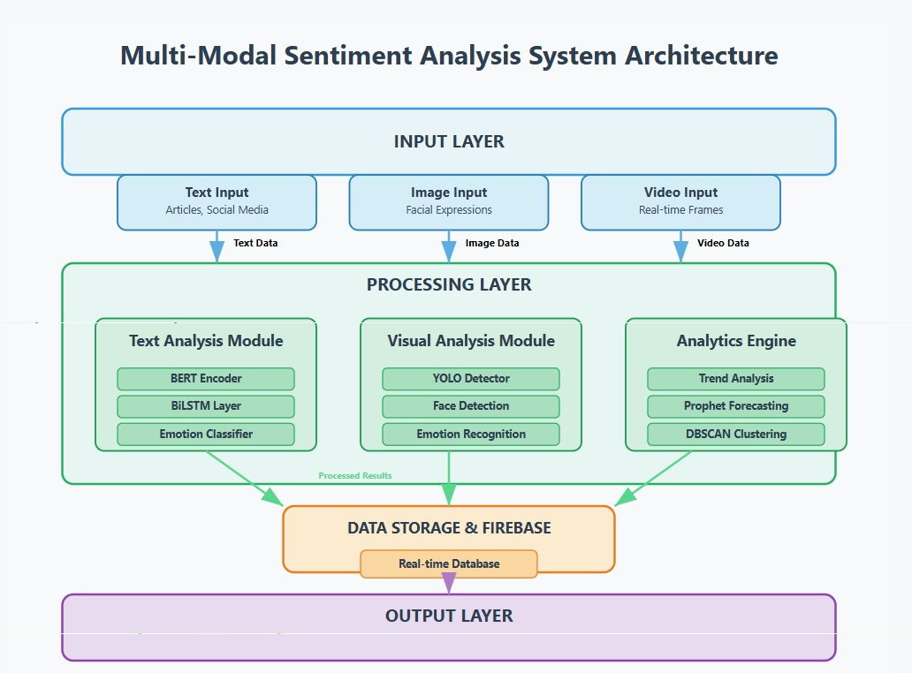
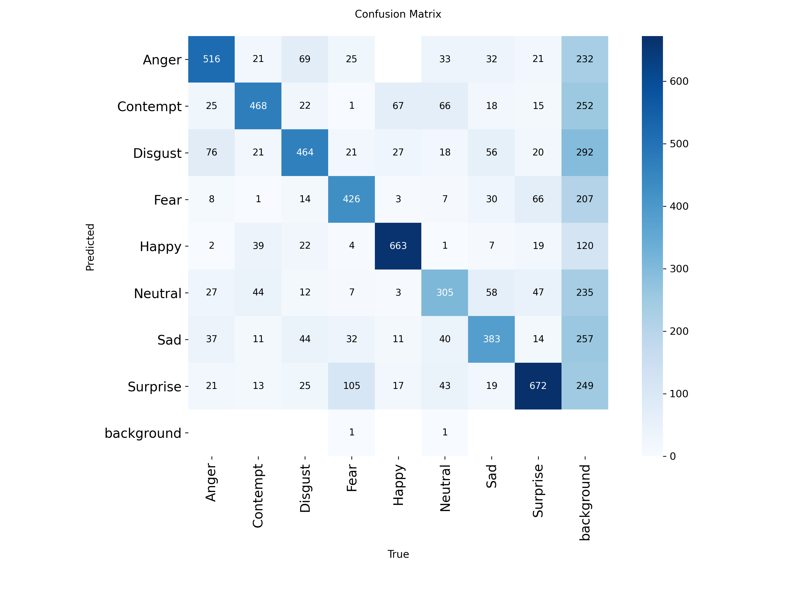
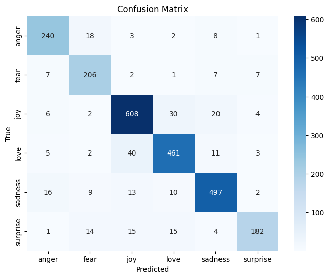
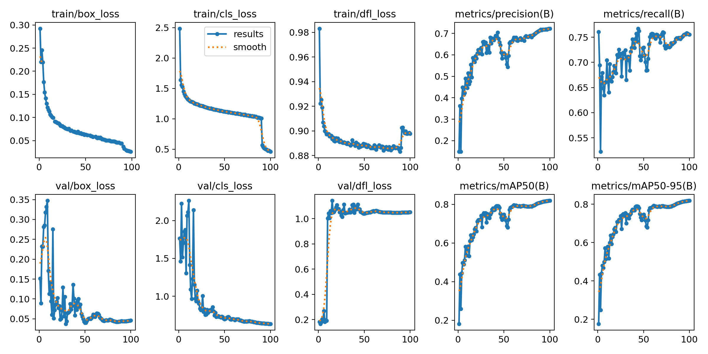

# Sentiment_Analysis-Emotion_Recognition

# 🎭 AI-Driven Sentiment Analysis System

## 📋 Project Overview

An advanced AI-powered system that performs comprehensive sentiment and emotion analysis across multiple modalities:
- **Text Analysis**: BERT-BiLSTM hybrid model for emotion detection
- **Image Analysis**: YOLO-based facial emotion recognition
- **Video Analysis**: Frame-by-frame emotion tracking
- **Trends Dashboard**: Real-time news sentiment tracking and forecasting

---

## 👥 Team Members

- **[Abhinandan Kumar]** - [23BDS001]
- **[Ankit Kushwaha]** - [23BDS008]
- **[Harsh Raj]** - [23BDS076]


---

## 🎯 Key Features

### 1. Text Emotion Analyzer
- Real-time emotion detection (joy, sadness, anger, fear, love, surprise)
- Confidence scoring with probability breakdown
- Sentiment classification (Positive/Negative/Neutral)

### 2. Image Emotion Analyzer
- Face detection and emotion recognition
- 8 emotion categories (Happy, Sad, Angry, Fear, Surprise, Disgust, Contempt, Neutral)
- Visual bounding boxes with emotion labels

### 3. Video Emotion Analyzer
- Frame-by-frame emotion tracking
- Real-time video processing
- Annotated output with emotion overlays

### 4. Trends Dashboard
- Multi-keyword sentiment tracking
- Historical trend analysis with Prophet forecasting
- DBSCAN clustering for pattern detection
- Interactive visualizations with Plotly
- 6 analysis phases covering comprehensive insights

---

## 🛠️ Technical Stack

### Backend
- **Flask** - Web framework
- **Python 3.8+** - Core language

### Machine Learning
- **TensorFlow/Keras** - Deep learning models
- **Transformers (BERT)** - Text embeddings
- **Ultralytics YOLO** - Computer vision
- **Prophet** - Time series forecasting
- **scikit-learn** - Clustering and preprocessing

### Data & Storage
- **Firebase Firestore** - Cloud database
- **Pandas/NumPy** - Data manipulation

### Visualization
- **Plotly** - Interactive charts
- **Matplotlib** - Static plots

### Deployment
- **ngrok** - Public URL tunneling
- **Flask-CORS** - Cross-origin support

---

## 📦 Installation & Setup

### Prerequisites

```bash
# Python 3.8 or higher
python --version

# pip package manager
pip --version
```

### Step 1: Clone the Repository

```bash
git clone https://github.com/your-username/sentiment-analysis-system.git
cd sentiment-analysis-system
```

### Step 2: Install Dependencies

```bash
pip install flask plotly scikit-learn firebase-admin ultralytics flask-cors pyngrok tensorflow transformers prophet cmdstanpy pandas numpy opencv-python nltk
```

### Step 3: Download NLTK Data

```python
import nltk
nltk.download('stopwords')
nltk.download('wordnet')
```

### Step 4: Install CmdStan (for Prophet)

```python
import cmdstanpy
cmdstanpy.install_cmdstan()
```

---

## 🔑 API Keys & Configuration

### 1. Firebase Setup

#### Generate Firebase Credentials:
1. Go to [Firebase Console](https://console.firebase.google.com/)
2. Create a new project or select existing
3. Navigate to **Project Settings** → **Service Accounts**
4. Click **Generate New Private Key**
5. Save the JSON file as `sentiment_firebase.json`

#### Update Path in Code:
```python
SERVICE_ACCOUNT_PATH = "/path/to/your/sentiment_firebase.json"
```

#### Firestore Database:
1. In Firebase Console, go to **Firestore Database**
2. Create a collection named `trends`
3. Ensure your service account has read/write permissions

### 2. ngrok Authentication

#### Get ngrok Auth Token:
1. Sign up at [ngrok.com](https://ngrok.com/)
2. Go to [Dashboard → Your Authtoken](https://dashboard.ngrok.com/get-started/your-authtoken)
3. Copy your authtoken

#### Update Token in Code:
```python
AUTHTOKEN = "your_ngrok_authtoken_here"
```

---

## 📁 Required Model Files

### Directory Structure

```
project_root/
├── model_save/
│   └── model_bert_v3/
│       ├── bert_bilstm_hybrid_v3_ft.keras
│       ├── tokenizer.pkl
│       ├── label_encoder.pkl
│       └── (BERT tokenizer files)
├── image_model_save/
│   └── best.pt (YOLO model)
├── sentiment_firebase.json
└── main.py
```

### Download Pre-trained Models:

**Text Model (BERT-BiLSTM)**:
- Train your own or download from your model repository
- Place in `model_save/model_bert_v3/`

**Image Model (YOLO)**:
- Train custom YOLO model for emotion detection
- Save as `best.pt` in `image_model_save/`

**Update Paths in Code**:
```python
DATA_DIR = "/path/to/model_save"
YOLO_MODEL_PATH = "/path/to/image_model_save/best.pt"
```

---

## 🚀 Running the Application

### Method 1: Google Colab (Recommended for Quick Setup)

1. Upload all files to Google Drive
2. Open Colab notebook
3. Mount Google Drive:
```python
from google.colab import drive
drive.mount('/content/drive')
```
4. Run the main script:
```python
!python /content/drive/MyDrive/your_project_folder/main.py
```

### Method 2: Local Machine

1. Navigate to project directory
2. Run Flask app:
```bash
python main.py
```

### Accessing the Application

Once running, you'll see:
```
✅ Flask server running on http://127.0.0.1:5077
🎉 YOUR PUBLIC URL IS: https://xxxx-xx-xx-xxx-xxx.ngrok.io
```

**Open the ngrok URL** in your browser to access the dashboard.

---

## 📊 Usage Guide

### Text Analyzer
1. Navigate to **Text** from homepage
2. Enter text in the input box
3. Click **Analyze Text**
4. View emotion, sentiment, and probability breakdown

### Image Analyzer
1. Navigate to **Image** from homepage
2. Click or drag-drop an image
3. Wait for processing
4. View detected emotions with bounding boxes

### Video Analyzer
1. Navigate to **Video** from homepage
2. Upload a video file (MP4, WebM, QuickTime)
3. Processing may take time depending on video length
4. Download or view annotated video

### Trends Dashboard
1. Click **Get Started (Trends)** from homepage
2. Explore 6 phases:
   - **Phase 1**: Single keyword analysis
   - **Phase 2**: Keyword comparison
   - **Phase 3**: Historical trends & alerts
   - **Phase 4**: Story timeline (last 5 days)
   - **Phase 5**: DBSCAN clustering
   - **Phase 6**: Sentiment forecasting

---

## 🔧 Configuration Options

### Keywords for Trends Dashboard
Edit in code:
```python
KEYWORDS = [
    "Artificial Intelligence",
    "ChatGPT",
    "Climate Change",
    "Elections",
    "Healthcare",
    "Startups",
    "Cybersecurity"
]
```

### Emotion-to-Sentiment Mapping
Customize mappings:
```python
emotion_to_sentiment = {
    "sadness": "Negative 👎",
    "anger": "Negative 👎",
    "fear": "Negative 👎",
    "love": "Positive 👍",
    "joy": "Positive 👍",
    "surprise": "Neutral 😐"
}
```

### Port Configuration
```python
PORT = 5077  # Change if needed
```

---

## 🐛 Troubleshooting

### Common Issues

#### 1. Firebase Connection Error
```
Error: Could not connect to Firestore
```
**Solution**: Verify `sentiment_firebase.json` path and Firestore permissions

#### 2. YOLO Model Not Loading
```
Error: Failed to load YOLO model
```
**Solution**: Check `best.pt` path and ensure model is compatible with ultralytics

#### 3. BERT Model Loading Issues
```
Error: Could not load BERT Hybrid model
```
**Solution**: 
- Verify all tokenizer files are present
- Ensure TensorFlow version compatibility
- Check custom layer registration

#### 4. ngrok Tunnel Failed
```
Error: ngrok tunnel creation failed
```
**Solution**: 
- Verify authtoken is correct
- Check internet connection
- Try different port

#### 5. Prophet Installation Fails
```
Error: CmdStan compilation failed
```
**Solution**:
```python
import cmdstanpy
cmdstanpy.install_cmdstan(force=True)
```

---

## 📈 Performance Optimization

### For Large Videos
- Reduce `imgsz` parameter in YOLO prediction
- Process fewer frames per second
- Use GPU if available

### For Many Keywords
- Limit keywords to 7-10 for better performance
- Cache frequently accessed data
- Use batch processing

---

## 🔒 Security Notes

- **Never commit** `sentiment_firebase.json` to version control
- Add to `.gitignore`:
```
sentiment_firebase.json
*.pkl
*.keras
*.pt
__pycache__/
```
- Keep ngrok authtoken private
- Use environment variables for production

---

## 📝 License

[Specify your license here - MIT, Apache 2.0, etc.]

---

## 🤝 Contributing

Contributions are welcome! Please:
1. Fork the repository
2. Create a feature branch
3. Commit your changes
4. Push to the branch
5. Open a Pull Request

---

## 📧 Contact

For questions or support:
- **Email**: [your-email@example.com]
- **Project Lead**: [Name]
- **GitHub**: [repository-link]

---

## 🙏 Acknowledgments

- **Ultralytics** - YOLO implementation
- **Hugging Face** - Transformers library
- **Facebook Prophet** - Time series forecasting
- **Firebase** - Cloud database services
- **ngrok** - Secure tunneling

---

## 📸 Screenshots

### Landing Page


### Text Analyzer


### Image Analyzer


### Video Analyzer



---

## 🎓 Academic References

[Add relevant research papers, datasets, or academic sources used]

---

**Last Updated**: [Date]
**Version**: 1.0.0
